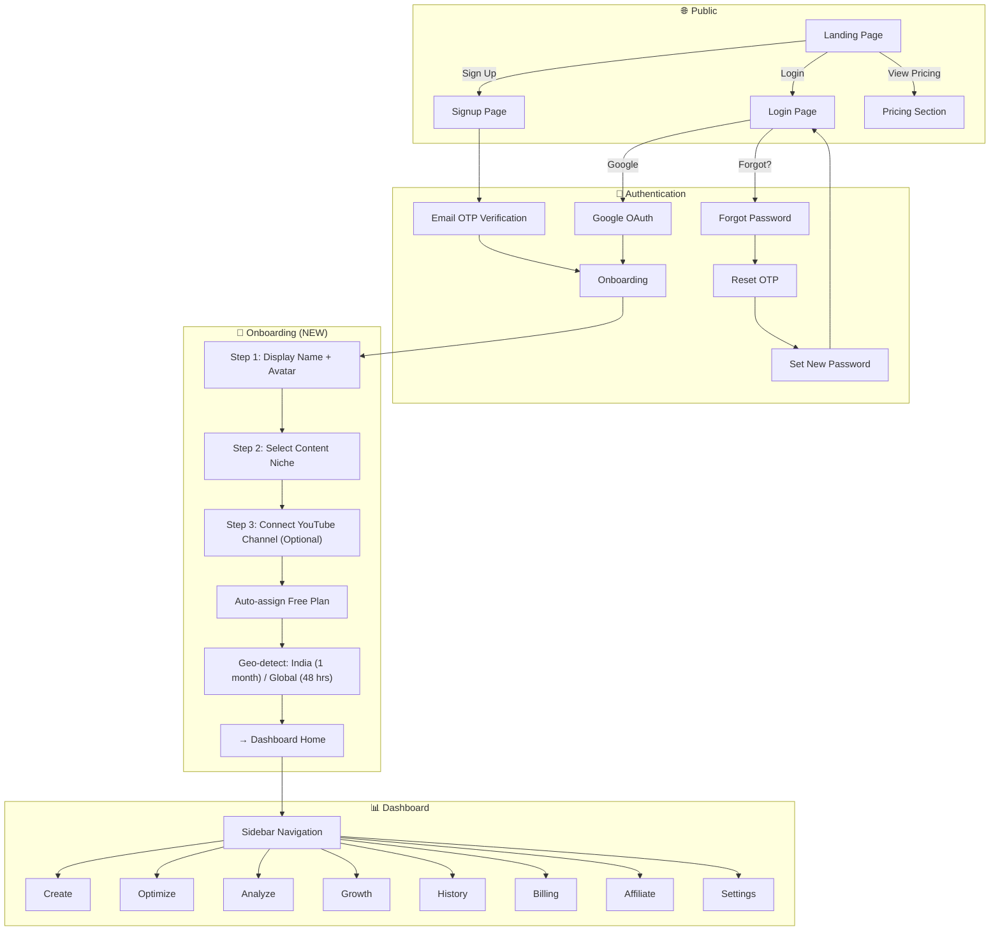
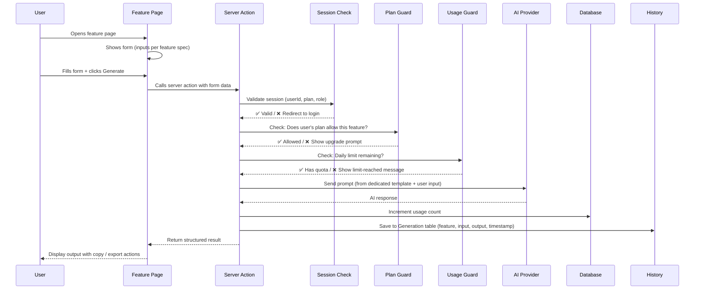
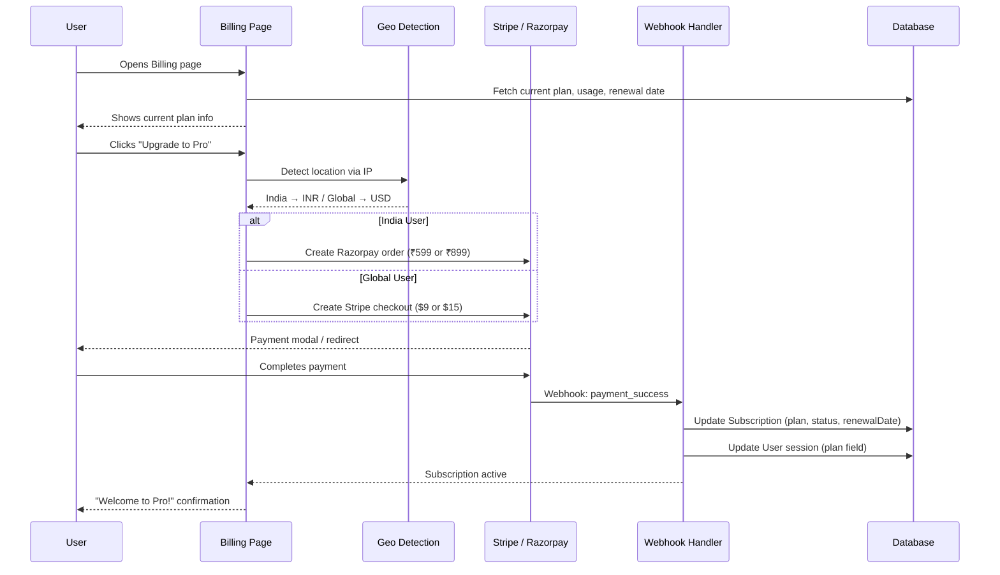
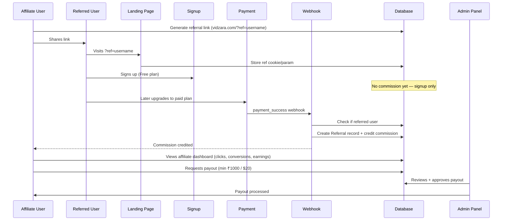
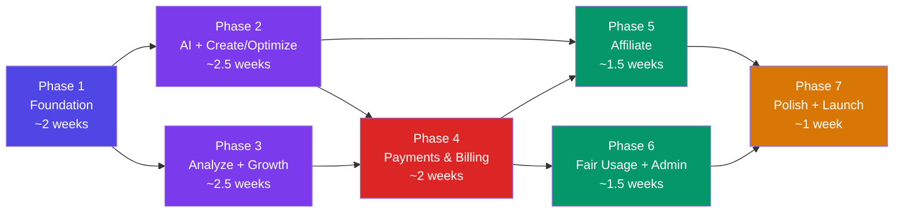

# Vidzara — Master Development Plan

> This document is the single reference for **what to build, in what order, and how everything connects**.
> Aligned with `AGENTS.md` (v2) — all feature specs, pricing, plans, and business rules are reflected here.

---

## Current State ✅

| Module | Status | Notes |
|--------|--------|-------|
| Marketing Landing Page | ✅ Done | Hero, Features, Pricing, Testimonials, FAQ, Workflows, Footer |
| Auth — Email + Password | ✅ Done | Better Auth, email OTP verification |
| Auth — Google OAuth | ✅ Done | Social login with account linking |
| Auth — Forgot / Reset Password | ✅ Done | Full OTP-based flow |
| Middleware | ✅ Done | `/dashboard/*` protected, login redirect |
| Prisma Schema | ⚠️ Auth-only | User, Session, Account, Verification — no feature models |
| Dashboard Shell | ⚠️ Scaffold | Sidebar with 8 groups, but all routes are `#` placeholders |

---

# Part 1 — Complete User Journey

This maps every step a user goes through, from landing to using features.



---

## Detailed User Flow: Using Any AI Feature

Every single AI feature follows this exact pipeline:



---

## Detailed User Flow: Subscription & Payment



---

## Detailed User Flow: Affiliate System



---

# Part 2 — Feature Access Matrix

This is the **exact** plan-gating logic derived from AGENTS.md. Every feature must check this at the server action level.

| # | Feature | Free | Limited Pro | Unlimited Pro |
|---|---------|------|-------------|---------------|
| 5.1 | Video SEO Generator | ✅ (limited/day) | ✅ | ✅ |
| 5.2 | Script Writer | ❌ Long scripts | Shorts only | All formats |
| 5.3 | Script Shortener | ❌ | ❌ | ✅ Unlimited only |
| 5.4 | Thumbnail Concept Generator | ✅ (limited/day) | ✅ | ✅ |
| 5.5 | Hook Failure Detector | ❌ | Shorts only | All |
| 5.6 | Content Safety Checker | ✅ (limited/day) | ✅ | ✅ |
| 5.7 | Topic Generator | ✅ (limited/day) | ✅ | ✅ |
| 5.8 | Outlier Detector | ✅ (limited/day) | ✅ | ✅ |
| 5.9 | Consistency Checker | ❌ | 5/day | Unlimited |
| 5.10 | Niche Finder | ❌ | 5/day | Unlimited |
| 5.11 | Growth Dashboard | Basic view | Full | Full |

### Free Trial Duration
- **India:** 1 month free trial
- **Global:** 48 hours free trial

---

# Part 3 — Development Phases (Detailed)

---

## Phase 1 — Foundation & Dashboard Infrastructure
**Goal:** Build everything every feature will depend on  
**Duration:** 1.5–2 weeks

> [!IMPORTANT]
> Phase 1 has **zero AI features**. It is pure infrastructure. Skip this and everything else breaks.

### 1.1 Prisma Schema Expansion

New/updated models needed:

```
UserProfile
├── userId (FK → User)
├── displayName
├── avatar
├── niche
├── youtubeChannelId (optional)
├── onboardingComplete (boolean)
├── country (detected)
└── createdAt

Subscription
├── id (UUID)
├── userId (FK → User)
├── plan (FREE | LIMITED_PRO | UNLIMITED_PRO)
├── billingCycle (MONTHLY | YEARLY)
├── status (ACTIVE | CANCELED | EXPIRED | TRIALING)
├── gateway (STRIPE | RAZORPAY)
├── gatewaySubscriptionId
├── trialEndsAt
├── currentPeriodEnd
└── createdAt / updatedAt

UsageRecord
├── id (UUID)
├── userId (FK → User)
├── feature (enum: VIDEO_SEO, SCRIPT_WRITER, etc.)
├── date (Date — for daily tracking)
├── count (Int)
└── Unique constraint: [userId, feature, date]

Generation
├── id (UUID)
├── userId (FK → User)
├── feature (enum)
├── input (JSON — what user provided)
├── output (JSON — what AI returned)
├── model (which AI model was used)
├── tokensUsed
├── createdAt

Coupon
├── id (UUID)
├── code (unique)
├── discountPercent
├── expiresAt
├── maxUses
├── usedCount
├── perUserLimit
├── country (null = global)
├── active (boolean)
└── createdAt

Affiliate
├── id (UUID)
├── userId (FK → User)
├── referralCode (unique)
├── commissionRate (Decimal)
├── enabled (boolean)
└── createdAt

Referral
├── id (UUID)
├── affiliateId (FK → Affiliate)
├── referredUserId (FK → User)
├── convertedAt (nullable — when paid)
├── commissionAmount
├── status (PENDING | CREDITED | PAID)
└── createdAt

AbuseLog
├── id (UUID)
├── userId (FK → User)
├── event (RATE_LIMIT | BURST | SUSPICIOUS_IP)
├── metadata (JSON)
└── createdAt
```

### 1.2 Onboarding Flow (New)

After first login:

| Step | Screen | Data Collected |
|------|--------|----------------|
| 1 | Welcome | Display name, avatar upload |
| 2 | Niche Selection | Dropdown + search (Gaming, Tech, Lifestyle, etc.) |
| 3 | YouTube Channel | Optional — paste channel URL or skip |
| 4 | Plan Assignment | Auto-assign Free + geo-detect trial duration |

- Route: `/dashboard/onboarding`
- Middleware checks `onboardingComplete` — if false, redirect here
- After completion → redirect to Dashboard Home

### 1.3 Dashboard Routing

Wire all sidebar links to real routes:

```
/dashboard                     → Dashboard Home
/dashboard/create/script-writer    → Script Writer
/dashboard/create/thumbnail        → Thumbnail Concept Generator
/dashboard/optimize/video-seo     → Video SEO Generator
/dashboard/optimize/script-shortener → Script Shortener
/dashboard/optimize/hook-detector  → Hook Failure Detector
/dashboard/optimize/content-safety → Content Safety Checker
/dashboard/analyze/topic-generator → Topic Generator
/dashboard/analyze/outlier-detector → Outlier Detector
/dashboard/analyze/niche-finder    → Niche Finder
/dashboard/analyze/consistency-checker → Consistency Checker
/dashboard/growth                  → Creator Growth Dashboard
/dashboard/history                 → Generation History
/dashboard/billing                 → Billing & Subscription
/dashboard/affiliate               → Affiliate Dashboard
/dashboard/settings                → Settings
```

Each route gets a placeholder page with proper layout + "Coming Soon" state.

### 1.4 Dashboard Home Page (Redesign)

Replace the current boilerplate chart page with:

- **Welcome header** with user's name
- **Usage summary cards** — generations used today / limit
- **Quick action buttons** — "Write a Script", "Generate SEO", "Check Hook"
- **Recent generations** — last 5 from History
- **Plan status card** — current plan, days remaining (for free trial)

### 1.5 Settings Page

- Profile editing (name, avatar, niche)
- Connected accounts (Google, YouTube channel)
- Theme toggle (light/dark)
- Danger zone (delete account)

### 1.6 Usage Tracking System

`lib/usage.ts`:

```
checkUsage(userId, feature) → { allowed: boolean, remaining: number, limit: number }
incrementUsage(userId, feature) → void
getUsageSummary(userId) → { [feature]: { used, limit } }
```

- Reads from `UsageRecord` table
- Limits defined per plan in a config constant
- Called by every server action before AI call

### 1.7 Plan Guard Utility

`lib/plan-guard.ts`:

```
checkFeatureAccess(plan, feature, context?) → { allowed: boolean, reason?: string }
```

- Returns `allowed: false` with upgrade prompt if plan doesn't cover feature
- `context` param allows checking sub-restrictions (e.g., Script Writer → Shorts only for Limited)

---

## Phase 2 — AI Engine + Core Creation & Optimization Tools
**Goal:** Ship the first AI-powered features  
**Duration:** 2–3 weeks

### 2.1 AI Engine Architecture

```
lib/ai/
├── provider.ts        → AI provider abstraction (OpenAI / Gemini / etc.)
├── engine.ts          → Core: generateAI(feature, input, userId)
├── prompts/
│   ├── video-seo.ts
│   ├── script-writer.ts
│   ├── script-shortener.ts
│   ├── hook-detector.ts
│   ├── content-safety.ts
│   ├── thumbnail-concept.ts
│   ├── topic-generator.ts
│   ├── outlier-detector.ts
│   ├── niche-finder.ts
│   └── consistency-checker.ts
└── types.ts           → Shared AI types
```

`engine.ts` pipeline:
1. Validate session
2. Check plan access (`plan-guard.ts`)
3. Check usage quota (`usage.ts`)
4. Load prompt template
5. Call AI provider
6. Log usage (+1)
7. Save to `Generation` table
8. Return structured output

### 2.2 Video SEO Generator (Feature 5.1)

**Route:** `/dashboard/create/video-seo` (under Create in sidebar, despite being an "Optimize" tool — placed in Create because users think of SEO as part of content creation)

**UI:**
- Input form: Topic textarea OR Key points OR Full script (tabs for input modes)
- Generate button
- Output card with sections: Titles (multiple), Description, Tags, Hashtags, Keywords, Caption, Thumbnail ideas
- Copy-to-clipboard per section
- Save to history button

**Server Action:** `actions/video-seo.ts`

**Plan Access:** All plans — Free has daily generation limit

### 2.3 Script Writer (Feature 5.2)

**Route:** `/dashboard/create/script-writer`

**UI:**
- Topic input
- Niche selector (from user profile or manual)
- Platform selector: YouTube / Shorts / Instagram
- Video type selector
- Generate button
- Output: Hook → Structured body → CTA
- Future-ready UI slots: tone slider, length selector, language dropdown (disabled with "Coming Soon")

**Plan Access:**
- Free → ❌ Long scripts (show upgrade prompt if YouTube selected)
- Limited Pro → Shorts + Instagram only
- Unlimited → All platforms

### 2.4 Hook Failure Detector (Feature 5.5)

**Route:** `/dashboard/optimize/hook-detector`

**UI:**
- Textarea: paste first 3–5 seconds or intro text
- Result: badge (❌ Weak / ⚠️ Average / ✅ Strong) + score + 3 improved hook suggestions

**Plan Access:**
- Free → ❌ completely
- Limited → Shorts hooks only
- Unlimited → All

### 2.5 Script Shortener (Feature 5.3)

**Route:** `/dashboard/optimize/script-shortener`

**UI:**
- Input: paste long script
- Slider: select 1–5 short outputs
- Output: N shorts-form scripts with hook-first structure

**Plan Access:** Unlimited plan **only** — all others see upgrade prompt

### 2.6 Content Safety Checker (Feature 5.6)

**Route:** `/dashboard/optimize/content-safety`

**UI:**
- Input fields: Title, Description, Tags, Script (all optional, at least one required)
- Output: Risk score (gauge/meter), highlighted risky phrases, policy issues, safe rewrite suggestions
- Clickbait risk detection
- Algorithm manipulation detection

**Plan Access:** All plans (with daily limits for Free)

### 2.7 History Page

**Route:** `/dashboard/history`

- Table/list of all past generations from `Generation` table
- Filter by: feature type, date range, search query
- Click row → expand full output
- Actions: copy, re-generate (pre-fill form), delete
- Pagination

---

## Phase 3 — Analysis & Growth Tools
**Goal:** Data-driven insights for creators  
**Duration:** 2–3 weeks

> [!NOTE]
> Phases 2 & 3 can run **in parallel** if multiple developers are working. They share the same AI engine from Phase 2.

### 3.1 Topic Generator (Feature 5.7)

**Route:** `/dashboard/analyze/topic-generator`

**UI:**
- Input: Competitor channel link or name
- Output card: Top performing topics, Title patterns, What works analysis, 5 viral topic ideas
- Each topic idea is actionable — click to send to Script Writer

**Plan Access:** All plans (daily limit for Free)

### 3.2 Outlier Detector (Feature 5.8)

**Route:** `/dashboard/analyze/outlier-detector`

**UI:**
- Input: Channel link
- Output: table of outlier videos with performance delta (views vs channel average)
- Pattern insights per outlier
- Sortable by delta

**Plan Access:** All plans (daily limit for Free)

### 3.3 Consistency Checker (Feature 5.9)

**Route:** `/dashboard/analyze/consistency-checker`

**UI:**
- Input: Channel link
- Output: Consistency score (visual meter), Posting frequency graph, Improvement plan (structured recommendations)

**Plan Access:**
- Free → ❌
- Limited Pro → 5/day
- Unlimited → Unlimited

### 3.4 Niche Finder (Feature 5.10)

**Route:** `/dashboard/analyze/niche-finder`

**UI:**
- Inputs: Interest, Skill level (Beginner/Intermediate/Advanced), Content type (Videos/Shorts/Both)
- Output: Beginner-friendly niche recommendation, Growth potential score, Monetization probability, Content direction advice

**Plan Access:**
- Free → ❌
- Limited → 5/day
- Unlimited → Unlimited

### 3.5 Creator Growth Dashboard (Feature 5.11)

**Route:** `/dashboard/growth`

**UI — Dashboard (not a one-shot generation):**
- Input: Channel link (or from connected YouTube account)
- Shows: Consistency score, Content type mix chart, Growth direction indicator (↑ Up / → Flat / ↓ Down), Continue / Stop recommendations
- Uses `recharts` for charts (already installed)

**Plan Access:**
- Free → Basic (limited metrics)
- Pro (both tiers) → Full dashboard

### 3.6 Thumbnail Concept Generator (Feature 5.4)

**Route:** `/dashboard/create/thumbnail`

**UI:**
- Input: Topic, script excerpt, or creative intent
- Output (structured, not vague): Thumbnail idea, Text suggestion, Text placement, Visual focus description, Color & contrast guidance, Emotion guidance
- Each output renders as a structured card with labeled sections

**Plan Access:** All plans (daily limit for Free)

---

## Phase 4 — Payments, Billing & Coupons
**Goal:** Monetize — enforce plan-based access  
**Duration:** 1.5–2 weeks

### 4.1 Geo Detection Service

`lib/geo.ts`:
- IP-based country detection (via API like ip-api.com or MaxMind)
- Returns: `{ country: string, currency: "INR" | "USD" }`
- Manual override stored in `UserProfile.country`
- Called during onboarding + billing page

### 4.2 Pricing Configuration

```typescript
// lib/pricing.ts
export const PRICING = {
  INR: {
    FREE:    { price: 0, trial: "1 month" },
    LIMITED: { monthly: 599, yearly: null },
    UNLIMITED: { monthly: 899, yearly: 8999 },
  },
  USD: {
    FREE:    { price: 0, trial: "48 hours" },
    LIMITED: { monthly: 9, yearly: null },
    UNLIMITED: { monthly: 15, yearly: 149 },
  },
} as const;
```

### 4.3 Payment Gateway Integration

**Stripe** (Global / USD):
- `lib/payments/stripe.ts` — create checkout session, manage subscription
- Webhook handler: `/api/webhooks/stripe`
- Events: `checkout.session.completed`, `invoice.paid`, `customer.subscription.updated`, `customer.subscription.deleted`

**Razorpay** (India / INR):
- `lib/payments/razorpay.ts` — create subscription, verify payment
- Webhook handler: `/api/webhooks/razorpay`
- Events: `subscription.activated`, `subscription.charged`, `subscription.cancelled`

Both webhooks update `Subscription` table → which gates feature access.

### 4.4 Billing Page

**Route:** `/dashboard/billing`

**UI:**
- Current plan card (plan name, status, renewal date)
- Usage meter (today's generations used / limit)
- Plan comparison table (Free vs Limited vs Unlimited)
- Upgrade / Downgrade buttons
- Coupon code input
- Invoice / payment history table
- Cancel subscription (with confirmation dialog)

### 4.5 Coupon System

**Prisma model:** `Coupon` (defined in Phase 1 schema)

**Logic in** `lib/coupons.ts`:
- `validateCoupon(code, userId, country)` → checks: exists, active, not expired, usage limit not reached, per-user limit, country restriction
- `applyCoupon(code, amount)` → returns discounted amount
- Real-time price recalculation on billing page
- Server-side validation **only** (no client-side discount display without verification)

### 4.6 Free Trial Logic

- On signup, auto-create `Subscription` with:
  - `plan: FREE`
  - `status: TRIALING`
  - `trialEndsAt: now + 1 month (India) OR now + 48 hours (Global)`
- When trial expires → `status: EXPIRED`
- Expired users see "Trial ended — upgrade to continue" on every feature page
- Cron or check-on-access for trial expiry

---

## Phase 5 — Affiliate System
**Goal:** Growth loop through referrals  
**Duration:** 1–1.5 weeks

### 5.1 Affiliate Dashboard

**Route:** `/dashboard/affiliate`

**UI:**
- Referral link display: `vidzara.com/?ref=username` (with copy button)
- Stats: Total clicks, Signups referred, Paid conversions, Total earnings, Pending payout
- Referral history table (who signed up, when, converted or not, commission amount)
- Payout request button (enabled when balance ≥ ₹1000 / $20)

### 5.2 Referral Tracking

- When user visits with `?ref=username`:
  - Store `ref` in cookie (30-day expiry)
  - On signup, create `Referral` record with `affiliateId` + `referredUserId`
  - `convertedAt` and `commissionAmount` remain null until paid subscription

- When referred user pays (webhook):
  - Find their `Referral` record
  - Set `convertedAt = now`
  - Calculate commission (`affiliate.commissionRate * subscription price`)
  - Set `status: CREDITED`

### 5.3 Admin Affiliate Controls

- Set default commission rate
- Enable / disable individual affiliates
- Approve / reject payout requests
- Mark payouts as completed
- View all affiliate activity

### 5.4 Payout Flow

1. Affiliate clicks "Request Payout"
2. System checks minimum threshold (₹1000 / $20)
3. Creates payout request with `status: PENDING`
4. Admin reviews in admin panel
5. Admin approves → marks `status: PAID` → manual bank transfer

---

## Phase 6 — Fair Usage & Admin Panel
**Goal:** Operational control and abuse prevention  
**Duration:** 1–1.5 weeks

### 6.1 Fair Usage / Abuse Detection

`lib/abuse.ts`:
- **Rate limiting:** Max N requests per minute per user (via in-memory or Redis)
- **Burst detection:** If user hits >X generations in Y minutes → flag
- **IP anomaly:** Multiple users from same IP → log
- All triggers logged to `AbuseLog` table
- Escalation: Warning → Rate limit → Temporary restriction → Suspension

### 6.2 Admin Panel

**Route:** `/dashboard/admin` (role-gated: `role === "ADMIN"`)

**Sections:**

| Section | Features |
|---------|----------|
| Users | Search, view profiles, change plan manually, suspend |
| Subscriptions | Overview table, manual plan assignment, cancel |
| Usage Analytics | Feature usage charts, top users, daily/weekly trends |
| Coupons | Create, edit, disable, view usage stats |
| Affiliates | Commission rates, approve payouts, enable/disable |
| Abuse Logs | View flags, take action (warn / restrict / suspend) |
| Prompt Editor | Edit AI prompt templates per feature (future) |

---

## Phase 7 — Polish, Performance & Launch
**Goal:** Production-quality release  
**Duration:** 1 week

### 7.1 Performance
- Dynamic imports for heavy dashboard components
- Skeleton loading states for every async boundary
- Database indexes on: `UsageRecord(userId, feature, date)`, `Generation(userId, createdAt)`, `Referral(affiliateId)`
- Edge caching for static marketing pages

### 7.2 SEO & Meta
- OpenGraph images for marketing pages
- Twitter cards
- Proper `<title>` tags on every dashboard route
- `sitemap.xml` + `robots.txt`

### 7.3 Error Handling
- Global error boundary component
- Toast feedback for every server action (success + failure) — using `sonner`
- Meaningful empty states for all list views
- Retry logic for failed AI calls

### 7.4 Security Audit
- CSRF on all Server Actions
- Rate limiting on AI and payment endpoints
- Input sanitization (Zod validation on every form already implied)
- Secrets audit — confirm no client-side exposure
- Session token rotation

### 7.5 Responsive Polish
- Dashboard pages fully responsive (sidebar collapses to sheet on mobile)
- All feature forms usable on mobile
- Touch-friendly interactions

---

# Part 4 — Phase Dependency Map



> [!TIP]
> **Phase 2 & 3 are parallel.** They both depend on Phase 1's infrastructure but are independent of each other.
> **Phase 5 (Affiliate) needs Phase 4 (Payments)** because commission only applies on paid subscriptions.

---

# Part 5 — Target Folder Structure

```
src/
├── actions/                         # Server Actions (one per feature)
│   ├── video-seo.ts
│   ├── script-writer.ts
│   ├── script-shortener.ts
│   ├── hook-detector.ts
│   ├── content-safety.ts
│   ├── thumbnail-concept.ts
│   ├── topic-generator.ts
│   ├── outlier-detector.ts
│   ├── niche-finder.ts
│   ├── consistency-checker.ts
│   ├── growth-dashboard.ts
│   └── billing.ts
├── app/
│   ├── (marketing)/
│   ├── (auth)/
│   ├── dashboard/
│   │   ├── layout.tsx
│   │   ├── page.tsx                 # Dashboard Home
│   │   ├── onboarding/page.tsx
│   │   ├── create/
│   │   │   ├── video-seo/page.tsx
│   │   │   ├── script-writer/page.tsx
│   │   │   └── thumbnail/page.tsx
│   │   ├── optimize/
│   │   │   ├── script-shortener/page.tsx
│   │   │   ├── hook-detector/page.tsx
│   │   │   └── content-safety/page.tsx
│   │   ├── analyze/
│   │   │   ├── topic-generator/page.tsx
│   │   │   ├── outlier-detector/page.tsx
│   │   │   ├── niche-finder/page.tsx
│   │   │   └── consistency-checker/page.tsx
│   │   ├── growth/page.tsx
│   │   ├── history/page.tsx
│   │   ├── billing/page.tsx
│   │   ├── affiliate/page.tsx
│   │   ├── settings/page.tsx
│   │   └── admin/
│   │       └── page.tsx
│   └── api/
│       ├── auth/[...all]/route.ts
│       └── webhooks/
│           ├── stripe/route.ts
│           └── razorpay/route.ts
├── components/
│   ├── dashboard/                   # Dashboard-specific UI components
│   │   ├── usage-card.tsx
│   │   ├── plan-badge.tsx
│   │   ├── feature-gate.tsx         # Wraps features with plan check
│   │   ├── generation-result.tsx    # Shared AI output display
│   │   └── onboarding-wizard.tsx
│   ├── marketing/                   # Landing page components
│   └── ui/                          # shadcn/ui primitives
├── lib/
│   ├── ai/
│   │   ├── provider.ts
│   │   ├── engine.ts
│   │   └── prompts/
│   ├── payments/
│   │   ├── stripe.ts
│   │   └── razorpay.ts
│   ├── usage.ts
│   ├── plan-guard.ts
│   ├── geo.ts
│   ├── coupons.ts
│   ├── abuse.ts
│   ├── storage.ts
│   ├── auth.ts
│   └── prisma.ts
├── hooks/
├── types/
│   ├── features.ts                  # Feature enums & types
│   ├── plans.ts                     # Plan enums & limits config
│   └── ai.ts                        # AI request/response types
└── constants/
    ├── pricing.ts                   # INR/USD pricing config
    └── limits.ts                    # Daily limits per plan per feature
```

---

# Part 6 — Summary Checklist

| Phase | What You Build | Duration | Depends On |
|-------|---------------|----------|------------|
| **1** | Schema, onboarding, routing, dashboard home, settings, usage tracking, plan guard | 1.5–2 wks | Auth ✅ |
| **2** | AI engine, Video SEO, Script Writer, Hook Detector, Script Shortener, Content Safety, History | 2–3 wks | Phase 1 |
| **3** | Topic Gen, Outlier, Consistency Checker, Niche Finder, Growth Dashboard, Thumbnail Concepts | 2–3 wks | Phase 1 |
| **4** | Stripe, Razorpay, billing page, coupons, plan enforcement, free trial logic | 1.5–2 wks | Phase 2 or 3 |
| **5** | Affiliate dashboard, referral tracking, payout flow, admin affiliate controls | 1–1.5 wks | Phase 4 |
| **6** | Fair usage / abuse detection, admin panel (users, subs, coupons, affiliates, abuse logs) | 1–1.5 wks | Phase 4 |
| **7** | Performance, SEO, error handling, security audit, responsive polish, testing | 1 wk | All |

**Total estimated:** ~10–14 weeks
