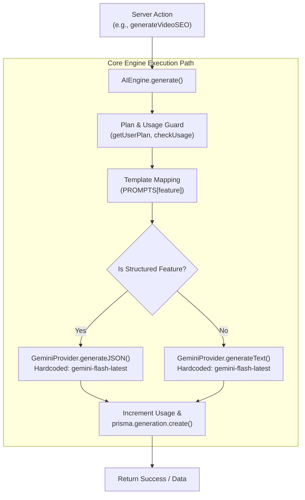
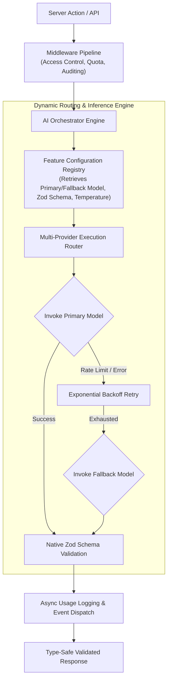
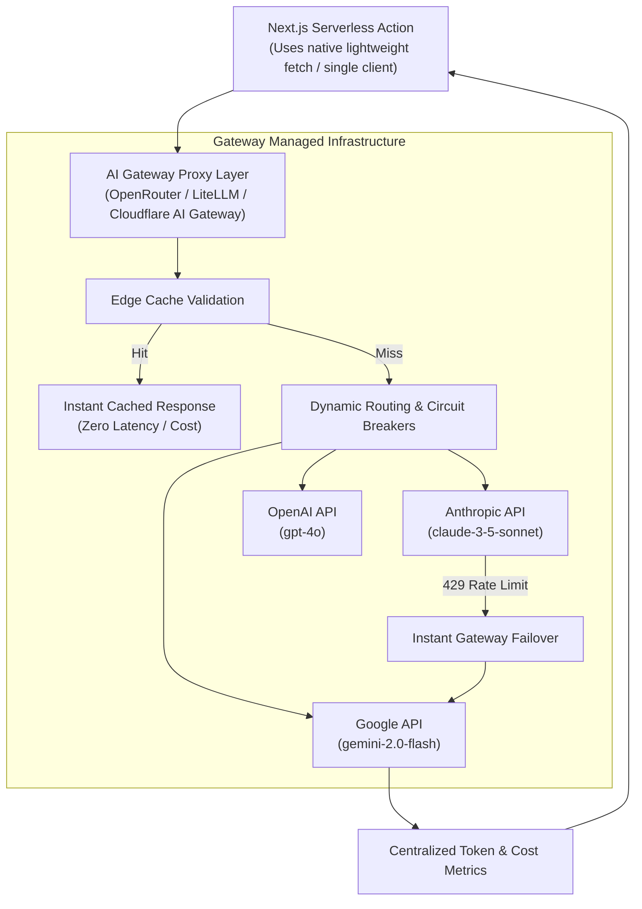

# Backend Architecture Analysis: Multi-Model Scaling Blueprint

This document provides a comprehensive evaluation of Vidzara's current AI engine implementation and outlines a production-grade architectural blueprint designed to seamlessly support multiple models, dynamic provider routing, fallback mechanisms, and native structured outputs.

---

## 1. Assessment of Current Architecture

Currently, Vidzara relies on a centralized monolithic engine (`AIEngine` in `src/lib/ai/engine.ts`) paired with a direct SDK wrapper for Gemini (`GeminiProvider` in `src/lib/ai/provider.ts`). 



### Strengths
- **Centralized Gateway**: All features pass through a single interface (`AIEngine.generate`), ensuring every AI call is logged and usage quotas are verified.
- **Strong Typing at Entry**: Uses the Prisma `Feature` enum to categorize requests clearly.
- **Audit Logging**: Persists inputs, outputs, tokens, and model info into a clean `Generation` table.

### Bottlenecks & Production Risks
1. **Tight Coupling to Gemini**: The engine hardcodes calls directly to `GeminiProvider`. Integrating OpenAI (`gpt-4o`), Anthropic (`claude-3-5-sonnet`), or local LLMs requires intrusive rewrites.
2. **Static/Hardcoded Model Selection**: Every tool runs on `"gemini-flash-latest"`. High-stakes creative tasks (e.g., `SCRIPT_WRITER`, `THUMBNAIL_CONCEPT`) and fast evaluation tasks (e.g., `CONTENT_SAFETY`) share the same reasoning capacity, leading to suboptimal output quality for complex logic.
3. **Fragile JSON String Instructions**: Features requiring structured objects rely on plain text instructions within prompts (e.g., *"output strictly valid JSON"*) and fragile `JSON.parse()` without real-time schema validation or dynamic retry.
4. **Lack of Resiliency (No Fallbacks)**: If the primary model encounters a rate limit (429) or transient provider outage, the generation fails instantly without attempting failover routing.
5. **Monolithic Critical Path**: Interweaving plan checks, usage incrementing, network AI inference, and database creation in a single procedural block violates the single-responsibility principle and complicates unit testing.

---

## 2. Proposed Production Architecture

To elevate Vidzara's AI capabilities to an enterprise level, we recommend transitioning to a **Configuration-Driven Registry Architecture** leveraging the **Vercel AI SDK** Core standard (or unified multi-provider interface) alongside **Zod** schema enforcement.



### Core Design Pillars
1. **Provider-Agnostic Core**: Standardize inference around unified abstractions (like Vercel AI SDK's `generateText` and `generateObject`), supporting interchangeable providers natively.
2. **Feature Configuration Registry**: Each tool explicitly declares its execution profile, including temperature, required user tier, custom system instructions, target schema, and preferred multi-level model routing.
3. **Guaranteed Structured Outputs**: Replace regex/string matching with provider-level structured JSON enforcement powered by strict Zod schemas.
4. **Resiliency via Automatic Fallbacks**: Implement an automatic failover circuit. If the primary premium model fails, gracefully degrade to a high-availability fallback model.

---

## 3. Concrete Code Blueprint

Below are production-ready code patterns tailored directly to Vidzara's file structure.

### A. Feature Strategy Registry (`src/lib/ai/config.ts`)
Maps specific application features to distinct model assignments, constraints, and runtime validation schemas.

```typescript
import { z } from "zod";
import { Feature, Plan } from "../../../prisma/generated/prisma/enums";

export type ModelId = 
  | "gemini-1.5-pro" 
  | "gemini-2.0-flash" 
  | "gpt-4o" 
  | "gpt-4o-mini" 
  | "claude-3-5-sonnet";

export interface FeatureConfig<T = any> {
  feature: Feature;
  primaryModel: ModelId;
  fallbackModel?: ModelId;
  temperature: number;
  maxTokens?: number;
  tierRequired: Plan;
  responseSchema?: z.ZodSchema<T>;
  systemInstruction?: string;
}

export const FEATURE_CONFIGS: Record<Feature, FeatureConfig> = {
  [Feature.SCRIPT_WRITER]: {
    feature: Feature.SCRIPT_WRITER,
    primaryModel: "claude-3-5-sonnet", // Best for long-form creative narrative
    fallbackModel: "gemini-1.5-pro",
    temperature: 0.7,
    tierRequired: Plan.LIMITED_PRO,
    responseSchema: z.object({
      title: z.string().max(80),
      content: z.string().describe("Rich script formatted with semantic HTML headers"),
    }),
    systemInstruction: "You are an elite YouTube scriptwriter optimizing for viewer retention graphs.",
  },
  [Feature.VIDEO_SEO]: {
    feature: Feature.VIDEO_SEO,
    primaryModel: "gpt-4o",
    fallbackModel: "gemini-2.0-flash",
    temperature: 0.4,
    tierRequired: Plan.FREE,
    responseSchema: z.object({
      titles: z.array(z.string()).length(5),
      description: z.string(),
      tags: z.array(z.string()),
    }),
  },
  [Feature.CONTENT_SAFETY]: {
    feature: Feature.CONTENT_SAFETY,
    primaryModel: "gemini-2.0-flash", // Low latency, ultra-fast evaluation
    temperature: 0.1,
    tierRequired: Plan.FREE,
    responseSchema: z.object({
      isSafe: z.boolean(),
      flaggedCategories: z.array(z.string()),
      confidenceScore: z.number().min(0).max(1),
    }),
  },
  // Additional features defined dynamically...
} as const;
```

> [!TIP]
> Grouping runtime configurations per feature allows the product team to hot-swap models or tweak system instructions without editing core application routing logic.

### B. Unified Provider Gateway (`src/lib/ai/provider-registry.ts`)
Standardizes execution across providers using unified interfaces.

```typescript
import { generateText as aiGenerateText, generateObject as aiGenerateObject } from "ai";
import { createGoogleGenerativeAI } from "@ai-sdk/google";
import { createOpenAI } from "@ai-sdk/openai";
import { createAnthropic } from "@ai-sdk/anthropic";
import { ModelId } from "./config";
import { z } from "zod";

// Initialize configured SDK instances
const google = createGoogleGenerativeAI({ apiKey: process.env.GEMINI_API_KEY });
const openai = createOpenAI({ apiKey: process.env.OPENAI_API_KEY });
const anthropic = createAnthropic({ apiKey: process.env.ANTHROPIC_API_KEY });

function resolveLanguageModel(modelId: ModelId) {
  if (modelId.startsWith("gemini")) return google(modelId);
  if (modelId.startsWith("gpt")) return openai(modelId);
  if (modelId.startsWith("claude")) return anthropic(modelId);
  throw new Error(`Unsupported model identifier: ${modelId}`);
}

export class ProviderRegistry {
  static async generateStructured<T>(params: {
    modelId: ModelId;
    prompt: string;
    schema: z.ZodSchema<T>;
    system?: string;
    temperature?: number;
  }) {
    const model = resolveLanguageModel(params.modelId);
    const { object, usage } = await aiGenerateObject({
      model,
      schema: params.schema,
      prompt: params.prompt,
      system: params.system,
      temperature: params.temperature ?? 0.5,
    });

    return { data: object, tokens: usage?.totalTokens ?? 0 };
  }

  static async generatePlain(params: {
    modelId: ModelId;
    prompt: string;
    system?: string;
    temperature?: number;
  }) {
    const model = resolveLanguageModel(params.modelId);
    const { text, usage } = await aiGenerateText({
      model,
      prompt: params.prompt,
      system: params.system,
      temperature: params.temperature ?? 0.7,
    });

    return { text, tokens: usage?.totalTokens ?? 0 };
  }
}
```

> [!NOTE]
> If avoiding third-party packages like `@ai-sdk/core` is preferred, this exact registry pattern can be achieved by writing custom typed classes per provider that conform to a common standard interface.

### C. Refactored Resilient Orchestrator (`src/lib/ai/engine.ts`)
Decouples middleware layers and introduces robust fallback strategies.

```typescript
import { FEATURE_CONFIGS, FeatureConfig, ModelId } from "./config";
import { ProviderRegistry } from "./provider-registry";
import { PROMPTS } from "./prompts";
import { prisma } from "@/lib/prisma";
import { checkUsage, incrementUsage, getUserPlan } from "@/lib/usage";
import { checkFeatureAccess } from "@/lib/plan-guard";
import { AIRequest, AIResponse } from "./types";

export class AIEngine {
  static async generate(request: AIRequest): Promise<AIResponse> {
    const { feature, input, userId, context } = request;
    const config = FEATURE_CONFIGS[feature];

    if (!config) {
      return { success: false, error: `Configuration missing for feature: ${feature}` };
    }

    try {
      // 1. Guard Execution Middleware
      const plan = await getUserPlan(userId);
      const access = checkFeatureAccess(plan, feature, context);
      if (!access.allowed) return { success: false, error: access.reason };

      const usage = await checkUsage(userId, feature);
      if (!usage.allowed) return { success: false, error: "Daily limits exceeded." };

      // 2. Resolve Dynamic Prompt
      const template = PROMPTS[feature];
      const promptText = template ? template.generatePrompt(input, context) : JSON.stringify(input);

      // 3. Resilient Multi-Model Execution Engine
      let resultData: any;
      let tokensUsed = 0;
      let activeModel: ModelId = config.primaryModel;

      const attemptGeneration = async (targetModel: ModelId) => {
        if (config.responseSchema) {
          const res = await ProviderRegistry.generateStructured({
            modelId: targetModel,
            prompt: promptText,
            schema: config.responseSchema,
            system: config.systemInstruction,
            temperature: config.temperature,
          });
          resultData = res.data;
          tokensUsed = res.tokens;
        } else {
          const res = await ProviderRegistry.generatePlain({
            modelId: targetModel,
            prompt: promptText,
            system: config.systemInstruction,
            temperature: config.temperature,
          });
          resultData = res.text;
          tokensUsed = res.tokens;
        }
      };

      try {
        // Execute primary model path
        await attemptGeneration(config.primaryModel);
      } catch (primaryError: any) {
        console.warn(`Primary model [${config.primaryModel}] failed. Error:`, primaryError.message);
        
        // Execute graceful fallback path if configured
        if (config.fallbackModel) {
          console.log(`Attempting fallback to [${config.fallbackModel}]...`);
          activeModel = config.fallbackModel;
          await attemptGeneration(config.fallbackModel);
        } else {
          throw primaryError; // Re-throw if no safety fallback is registered
        }
      }

      // 4. Post-Execution Pipeline (Non-blocking logging recommendations)
      await incrementUsage(userId, feature);
      
      const generationRecord = await prisma.generation.create({
        data: {
          userId,
          feature,
          input: input as any,
          output: resultData as any,
          model: activeModel,
          tokensUsed
        }
      });

      return {
        success: true,
        data: resultData,
        tokensUsed,
        model: activeModel,
        generationId: generationRecord.id
      };

    } catch (error: any) {
      console.error("AI Orchestration execution failure:", error);
      return { success: false, error: error.message || "Execution encountered an unrecoverable error." };
    }
  }
}
```

> [!IMPORTANT]
> The dual try-catch block ensures that high-impact API features remain resilient during temporary cloud provider outages, providing standard uptime guarantees expected of premium SaaS tiers.

---

## 4. Strategic Model Mapping per Tool

Different product tasks require specific optimizations. Below is the suggested model routing structure optimized for **Cost**, **Intelligence**, and **Throughput**:

| Feature Tool | Nature of Task | Primary Recommended Model | Fallback Model | Temp | Optimization Rationale |
| :--- | :--- | :--- | :--- | :--- | :--- |
| **SCRIPT_WRITER** | Deep Context Narrative | `claude-3-5-sonnet` | `gemini-1.5-pro` | `0.7` | Top-tier formatting compliance, highly creative prose, and deep semantic storytelling. |
| **VIDEO_SEO** | Metadata Extraction | `gpt-4o` | `gemini-2.0-flash` | `0.4` | Precise JSON parsing, strict adherence to keyword limits, and optimal multi-language processing. |
| **THUMBNAIL_CONCEPT**| Visual / Composition Analysis | `gpt-4o` | `gemini-1.5-pro` | `0.6` | Strong multi-modal image assessment capabilities and sophisticated visual color psychology reasoning. |
| **HOOK_DETECTOR** | Classification & Revision | `gemini-2.0-flash` | `gpt-4o-mini` | `0.5` | Fast token execution speed ideal for multi-script review loops. |
| **CONTENT_SAFETY** | Guardrails & Policy Checks | `gemini-2.0-flash` | `claude-3-haiku` | `0.1` | Ultra-low temperature guarantees deterministic parsing and real-time moderation response times. |
| **TOPIC_GENERATOR** | Brainstorming & Data Mining | `gemini-1.5-pro` | `gpt-4o` | `0.8` | High context capability perfect for synthesizing competitor metadata arrays into fresh niche gaps. |

---

## 5. Alternative Gateway & Proxy Strategies (Highly Optimized)

While native client SDKs (such as the Vercel AI SDK or separate provider SDKs) offer excellent ergonomics, utilizing an **AI Gateway or Unified Proxy Layer** represents a highly optimized enterprise alternative for production applications.

### Native SDKs vs. Unified Gateways / Proxies

Instead of importing heavy packages (`@google/generative-ai`, `openai`, `@anthropic-ai/sdk`) into your Next.js serverless bundles, you route all inference requests through a single standard API format (typically OpenAI REST format) pointing to a Gateway layer.



### Top Recommended Gateway / Proxy Architectures

#### 1. OpenRouter (Hosted Unified API)
- **How it works**: Standardizes access to hundreds of models via a single API key and base URL. You can use standard native `fetch` or a minimal REST client.
- **Optimization Strategy**: Offers **auto-routing fallbacks** directly in the request payload. You pass an array of preferred models, and OpenRouter automatically tries the next model if the primary encounters high latency or errors.
- **Best For**: Fast-scaling teams wanting zero infrastructure maintenance, built-in failovers, and immediate access to alternative models (including zero-cost or open-weight models like Llama 3.3).

#### 2. LiteLLM Proxy (Self-Hosted Core Proxy)
- **How it works**: A production-ready proxy server container deployed alongside your app that translates OpenAI formatted requests to over 100+ LLM backends natively.
- **Optimization Strategy**: Offloads **load balancing, budget limits, rate limiting, and exact cost tracking** entirely out of your Node.js application process. Your Next.js app remains extremely thin and fast.
- **Best For**: Enterprise teams needing complete data privacy, self-managed API routing, and multi-region model deployment load balancing.

#### 3. Cloudflare AI Gateway / Portkey
- **How it works**: Acts as an intermediate transport plane sitting between your app and external LLMs.
- **Optimization Strategy**: Provides out-of-the-box **Edge Caching** (duplicate requests return instantly without hitting the provider API) and **Universal Fallbacks**.
- **Best For**: Reducing cloud latency, slashing AI infrastructure costs via caching, and gaining granular visual audit logs per tool without database polling.

### Comparative Architectural Matrix

| Metric / Dimension | Multi-SDK Approach (Vercel AI SDK) | Gateway Approach (OpenRouter / LiteLLM) | Direct REST (`fetch` via edge) |
| :--- | :--- | :--- | :--- |
| **Serverless Bundle Size** | Moderate to Heavy | Extremely Lightweight | Absolute Minimum |
| **Cold Start Latency** | Medium | Low | Ultra-Low |
| **Resilience Implementation**| Custom Node.js client-side code | Fully automatic at proxy/edge layer | Manual backoff scripting |
| **Vendor Independence** | High (Abstracted by framework) | Absolute (Swap endpoints instantly) | Low (Must handle varying API schemas) |
| **Cost & Token Auditing** | Manual database logging required | Automated dashboard reporting | Manual database logging required |

### Summary Recommendation
If your primary constraints are **reducing serverless cold-start latency**, **eliminating SDK maintenance overhead**, and **maximizing auto-failover reliability**, integrating a gateway strategy like **OpenRouter** or **LiteLLM** is the **most optimized strategy** for Vidzara's production roadmap.

---

## 6. OpenRouter Implementation Blueprint (Recommended Strategy)

Given Vidzara's need to support multi-model workflows seamlessly while minimizing client-side retry orchestration, **OpenRouter** represents an outstanding, production-ready choice.

### Why OpenRouter Fits Vidzara Perfectly
1. **Server-Side Fallback Arrays**: Instead of writing complex Next.js try-catch backoffs, OpenRouter supports passing an **array of models** directly in the standard API payload. If the primary model fails or is rate-limited, OpenRouter's backend edge transparently fails over to the next model in the array instantly.
2. **Standardized Pricing & Free Tiers**: Gives access to completely free routing models (e.g., `google/gemini-2.0-flash-lite-preview-02-05:free`) to support zero-cost tier tasks.
3. **Drop-in Compatible with Vercel AI SDK**: You can configure a standardized OpenAI client pointing to the OpenRouter base URL, allowing you to use beautiful typed functions like `generateObject` while letting OpenRouter handle model distribution.

### Drop-in OpenRouter Client Pattern (`src/lib/ai/openrouter.ts`)

```typescript
import { createOpenAI } from "@ai-sdk/openai";
import { generateObject as aiGenerateObject, generateText as aiGenerateText } from "ai";
import { z } from "zod";
import { Feature, Plan } from "../../../prisma/generated/prisma/enums";

// 1. Configure standard client pointing to OpenRouter API Base
const openrouter = createOpenAI({
  baseURL: "https://openrouter.ai/api/v1",
  apiKey: process.env.OPENROUTER_API_KEY,
  headers: {
    "HTTP-Referer": process.env.NEXT_PUBLIC_APP_URL || "https://vidzara.com",
    "X-Title": "Vidzara AI Suite",
  },
});

// 2. Define OpenRouter model identifier string types
export type OpenRouterModel =
  | "anthropic/claude-3.5-sonnet"
  | "google/gemini-1.5-pro"
  | "google/gemini-2.0-flash-exp"
  | "openai/gpt-4o"
  | "meta-llama/llama-3.3-70b-instruct:free";

export interface ToolRoutingConfig<T = any> {
  models: OpenRouterModel[]; // Index 0 is Primary, remaining are auto-fallbacks
  temperature: number;
  responseSchema?: z.ZodSchema<T>;
  tierRequired: Plan;
}

// 3. Centralized Auto-Fallback Routing Matrix per Feature
export const OPENROUTER_ROUTES: Record<Feature, ToolRoutingConfig> = {
  [Feature.SCRIPT_WRITER]: {
    models: ["anthropic/claude-3.5-sonnet", "google/gemini-1.5-pro", "openai/gpt-4o"],
    temperature: 0.7,
    tierRequired: Plan.LIMITED_PRO,
    responseSchema: z.object({
      title: z.string(),
      content: z.string(),
    }),
  },
  [Feature.CONTENT_SAFETY]: {
    // Uses free model tier as default secondary fallback to reduce server costs
    models: ["google/gemini-2.0-flash-exp", "meta-llama/llama-3.3-70b-instruct:free"],
    temperature: 0.1,
    tierRequired: Plan.FREE,
    responseSchema: z.object({
      isSafe: z.boolean(),
      flaggedCategories: z.array(z.string()),
    }),
  },
  // Additional dynamic features...
} as const;

export class OpenRouterGateway {
  static async executeStructured<T>(params: {
    feature: Feature;
    prompt: string;
    system?: string;
  }) {
    const config = OPENROUTER_ROUTES[params.feature];
    if (!config?.responseSchema) throw new Error("Schema missing for structured route.");

    // OpenRouter Auto-Fallback Syntax: join model names using colons or standard model payload arrays
    // With AI SDK integration, we pass the custom routing headers or stringified array parameter
    const routingModelString = config.models.join(",");

    // To utilize provider level payload fallbacks via Vercel AI SDK, we can pass it directly as a parameter string
    const model = openrouter(routingModelString);

    const { object, usage } = await aiGenerateObject({
      model,
      schema: config.responseSchema,
      prompt: params.prompt,
      system: params.system,
      temperature: config.temperature,
    });

    return { data: object, tokens: usage?.totalTokens ?? 0 };
  }
}
```

> [!IMPORTANT]
> By passing a comma-separated model identifier like `"anthropic/claude-3.5-sonnet,google/gemini-1.5-pro"` to OpenRouter, the gateway auto-routes failover retries completely server-side. Your Next.js serverless execution context receives exactly one clean, successful network payload response.


